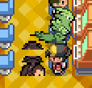

# REGISTRO DE BUGS Y CONTROL DE VERSIONES

Este documento recopila las incidencias reportadas, clasificadas por su estado y agrupadas según la versión de la ROM (`.gba`) y el commit de GitHub donde fueron solventadas.

---

## 🟢 BUGS RESUELTOS POR VERSIÓN Y COMMITS

### 📦 Versión `pokehns-0.9.0-20260920-bloque6-endrino-es.gba`

- **Fecha**: 20/09/2026
- **Commit**: `2552c7f702` (`feat: indicador nuzlocke en start menu, capturas, evolucion, veto OHKO y fixes Azalea`)

**Contenido traducido en esta build:**

- [x] **Ruta 44 y Ruta Helada**: Entrenadores, carteles, Chica Kimono, puzles y eventos de Pokémon.
- [x] **Ciudad Endrino**: Exterior, casas, tienda, Centro Pokémon y servicios Quita/Recuerda-Movimientos.
- [x] **Gimnasio Endrino**: Entrenadores dragón, Débora, rechazo inicial de la medalla, revancha y guía.
- [x] **Guarida Dragón**: Entrenadores, Rival, prueba del Maestro, Medalla Dragón y entrega de Dratini.
- [x] **Auditoría técnica**: 16 mapas revisados sin cadenas inglesas detectadas, concatenaciones defectuosas ni líneas superiores a 35 caracteres.

### 📦 Versión `pokehns-0.8.1-20260920-bloque2-revision-es.gba`

- **Fecha**: 20/09/2026
- **Commit**: `2552c7f702` (incluye la revisión de mapas y el lote de Endrino)

**Incidencias resueltas en esta build:**

- [x] **Ruta 33**: Traducidos el Montañero Anthony, sus revanchas y la entrenadora situada tras Cueva Unión.
- [x] **Cueva Unión**: Revisadas las tres plantas, corregida terminología y reformulados diálogos incoherentes.
- [x] **Ruinas Alfa y Pueblo Azalea**: Traducidas las cadenas inglesas restantes en B1F, laboratorio, cámaras, Casa de César, carbonería y eventos del Encinar.
- [x] **Formato del Bloque 2**: Corregidas cadenas concatenadas y textos de más de 35 caracteres en Ruta 32, Torre Bellsprout, Ruinas Alfa, Cueva Unión y Azalea.
- [x] **Sincronización**: Añadidos Ruta 33 y Ruinas Alfa B1F a `sync_latest.ps1` y corregida una coma ausente en la lista de archivos.

### 📦 Versión `pokehns-0.8.0-20260920-nuzlocke-ui-bugfix-es.gba`

- **Fecha**: 20/09/2026
- **Commit**: `2552c7f702`

**Incidencias resueltas en esta build:**

- [x] **Indicador Nuzlocke por zona**: El popup del nombre muestra una Poké Ball cuando la oportunidad de captura de la zona ya está consumida.
- [x] **Chica de la Ruta 36**: Corregido el salto de diálogo de Growlithe.
- [x] **Objetos modernos reportados**: Traducidos plumas, cápsulas y parches de habilidad, mentas, caramelos, chapas, confites, semillas, Moneda Gimmighoul, teralitos y mochis.
- [x] **MT y MO**: Renombradas las MT visibles y traducidos sus mensajes de uso.
- [x] **Pokégear**: Traducidos menús, ayudas, teléfono, nombres del mapa, emisoras y programas de radio.
- [x] **Clases de entrenador**: Traducidas las clases visibles; los nombres propios se conservan.
- [x] **Combate y captura**: Traducidos los mensajes reportados de victoria, derrota, empate, captura, Pokédex y petición de mote.
- [x] **Pantalla de motes**: Traducidos títulos y controles.
- [x] **Movimientos de campo**: Traducidos avisos de Corte, Golpe Roca, Golpe Cabeza, Fuerza, Cascada, Buceo, Torbellino y Treparrocas.
- [x] **Cueva Unión**: Traducidos los entrenadores de las tres plantas.

### 📦 Versión `pokehns-0.6.2-20260920-bugfix2-es.gba`

- **Commit WSL / GitHub**: `c15764d` (`traduccion-es`)
- **Commit Windows**: `65050f37de` (`Completar traduccion de Ruinas Alfa, casas y tiendas de Malva y Azalea, y ajustar lineas de dialogo`)
- **Fecha**: 20/09/2026

**Incidencias resueltas en esta build:**

- [x] **Ruinas Alfa sin traducir**: Traducidos todos los científicos, entrenadores, textos de fósiles y cámaras de puzles (`RuinsOfAlph_Outside_hns`, `RuinsOfAlph_Lab_hns`, `RuinsOfAlph_PuzzleAndRewardChambers_hns`).
- [x] **NPCs pendientes en Ciudad Malva**: Traducida la chica ("She uses the names of her favorite things to eat"), habitantes de casas y dependientes de tiendas y centro pokémon.
- [x] **Pueblo Azalea y Ruta 32**: Traducidos carbonería, casa de César, pescadores y tiendas.
- [x] **Auditoría de textos cortados / incompletos del Bloque 2**: Revisadas y reajustadas todas las frases que desbordaban la caja de diálogo (0 líneas superiores a 35 caracteres en todo el Bloque 2).

---

### 📦 Versión `pokehns-0.6.1-20260920-bugfix1-es.gba`

- **Commit WSL / GitHub**: `30b768a` (`traduccion-es`)
- **Commit Windows**: `5404e1c075` (`Corregir bugs reportados: BOY/GIRL, muebles, PC, items, bayas, combates y textos de Ciudad Malva y Bloque 2`)
- **Fecha**: 20/09/2026

**Incidencias resueltas en esta build:**

- [x] **Selección Chico/Chica**: `BOY` y `GIRL` cambiados a `CHICO` y `CHICA` al iniciar nueva partida (`src/strings.c`).
- [x] **Muebles y PC**: Librerías, estanterías y floreros en español (`data/text/check_furniture.inc`); menús y opciones de PC en español (`data/text/pc.inc`, `src/player_pc.c`).
- [x] **Árboles de bayas**: Cadenas completas de recolección y brote de bayas traducidas (`data/scripts/berry_tree.inc`).
- [x] **Combates y Repartir Exp.**: Mensaje de aviso de cambio de Pokémon del rival y texto del Repartir Exp. traducidos (`src/battle_message.c`).
- [x] **Corrección en Ciudad Malva**: Corregido error tipográfico `PEGABLO` $\rightarrow$ `PEGASO` y textos de la Academia Pokémon (`Route31_hns/scripts.inc`).
- [x] **Lote 1 de objetos**: Antiparalizador, Shalour Sable y Muscle Feather traducidos en `src/data/items.h`.

---

### 📦 Versión `pokehns-0.5.0-20260920-bloque4-es.gba`

- **Commit Windows**: `287bb0c47f` (`quitados movs mega y gigamax de la pool`) y `93ee5eb305`
- **Fecha**: 20/09/2026

**Incidencias resueltas en esta build:**

- [x] **Randomizer**: Quitar ataques Z y ataques Max de la pool de movimientos del Randomizer (acotado estrictamente a Gen 9 estándar, 1 hasta 847 en `src/randomizer.c`).

---

### 📦 Versiones Iniciales y Fase 1 (`pokehns_fase1.gba` / Commits Base)

- **Commits**: `1b1838c4d2`, `d04b772790`, `501577b488`, `de13653c95`, `0d6be416da`, `074c9e0a58`

**Incidencias resueltas:**

- [x] Primer diálogo para poner la hora en el reloj.
- [x] Información del reloj tras configurar la hora.
- [x] Mensajes previos del menú Nuzlocke.
- [x] Texto en inglés inicial del Profesor Oak.
- [x] Carteles flotantes de ciudades y rutas.
- [x] Categoría de especie del inicial (ej. "POKéMON HOJA" en vez de "LEAF").
- [x] Mensajes de obtención de objetos ("recibes la poción...").
- [x] Interfaz y menús base de combate.
- [x] Mensajes de la televisión.
- [x] Diálogos de compra/venta de las Tiendas Pokémon.
- [x] Diálogos de enfermeras en Centros Pokémon.
- [x] Diálogo de cura de la madre en casa del jugador.
- [x] Mensaje de guardado de partida.
- [x] Bolsa durante el combate.
- [x] Mensaje al recibir el dinero tras vencer en combate.
- [x] Mensaje al registrar a un entrenador en el Pokénav.
- [x] Opciones "SÍ" y "NO" (sustituyendo "YES" y "NO").
- [x] Puestos fronterizos entre rutas (Gates del Bloque 1 y 2).
- [x] Diálogos de la Ruta 46 junto a Cueva Oscura.
- [x] Ajuste visual de solapamiento en ficha de datos ("PODER").

### Versión 0.10.0 (2026-09-20 - Nuzlocke, Combates, Evolución y Ajustes Azalea)

- **Commit**: `2552c7f702`

- [x] **Indicador Nuzlocke en el menú START**: Retirada la Poké Ball del popup de mapa y añadido indicador de zona (`ZONA: LIBRE` en verde / `ZONA: GASTADA` en rojo) en la ventana superior del reloj al abrir el menú START.
- [x] **Capturas y fallos de Poké Ball**: Traducido `¡Ya está! ¡{STR_VAR_1} atrapado!` (`GOTCHA!`), y mensajes de captura fallida (`¡Casi lo consigues!`, `¡Vaya! ¡El POKéMON se ha escapado!`, etc.).
- [x] **Combates dobles traducidos**: Mensajes de salida simultánea al combate y retirada traducidos al castellano.
- [x] **Evolución Pokémon traducida**: Mensajes de inicio (`¿Eh? ¡{STR_VAR_1} está evolucionando!`) y finalización (`¡Enhorabuena! ¡Tu {STR_VAR_1} ha evolucionado a {STR_VAR_2}!`) completamente en español.
- [x] **Team Rocket y César en el Pozo Slowpoke**: Textos corregidos y refactorizados a <= 34 caracteres por línea sin desbordes.
- [x] **Rival en Pueblo Azalea**: Textos ajustados sin cortes de caja.
- [x] **Gimnasio de Pueblo Azalea (Antón / Bugsy)**: Nombres corregidos y formateo de diálogos de batalla y medalla ajustados.
- [x] **Filtro OHKO en Nuzlocke**: Prohibidos los movimientos de KO en un golpe (`Guillotina`, `Perforador`, `Fisura`, `Frío Polar`) en la ruleta del randomizer de movimientos cuando el modo Nuzlocke está activo (sin eliminarlos del juego base).

---

## 🔴 BUGS PENDIENTES (EN COLA DE RESOLUCIÓN)

- [ ] **Auditoría completa de expansión**: Todavía existen cadenas inglesas no reportadas en sistemas secundarios y mensajes modernos. Se tratarán por bloques para poder revisarlas dentro del juego.
- [ ] **Tienda de MT de Ciudad Trigal**: al comprar solo aparece el número de la MT; estudiar cómo mostrar también el nombre del movimiento junto al número.
- [x] **Sprite overworld de Knekro desordenado**: corregido el empaquetado de la hoja horizontal con `-mwidth 2 -mheight 4`; restaurados los nueve frames y sus cuatro orientaciones. La solución anterior de repetir el frame frontal no corregía el `.4bpp` corrupto.
- [x] **Combate de Knekro cargaba un montañero y datos inválidos**: la definición se había añadido por error a `src/data/trainers.party`, que no forma parte de la build HnS. Trasladada a `src/data/trainers_hns.party`, de modo que `TRAINER_KNEKRO_HNS` carga su sprite frontal y su equipo reales.
- [x] **Knekro cambiaba de tamaño al girar**: los tres frames laterales ocupaban 25 píxeles de alto frente a los 20–21 de norte/sur. Compactados a 21 píxeles manteniendo los pies alineados y la paleta indexada de 16 colores.
- [x] **Identidad y acceso al combate de Knekro**: exige la Medalla Planicie de Blanca, avisa de la dificultad y permite rechazar el reto. Su equipo pasa a representar su histórico competitivo con Jolteon, Starmie y Snorlax, acompañado de diálogos y bromas propios.

  

### Lote de sistemas auditados — commit `a70c7e43ee`

- [x] **Mensajes de combate secundarios**: Auditadas y traducidas 475 cadenas de estadísticas, habilidades, climas, terrenos, objetos, mecánicas residuales y sistemas modernos.
- [x] **Almacenamiento y flujo posterior de captura**: Traducidos el envío al PC, el cambio automático de CAJA, las CAJAS llenas y la elección entre equipo y PC.
- [x] **Menú del Pokégear**: Rótulos gráficos sustituidos por MAPA y PERFIL POKéMON; ayudas, marcas, cintas y descripciones traducidas.
- [x] **Mapas de los Centros Pokémon**: Interfaz común traducida y acción {R_BUTTON} FLY sustituida por {R_BUTTON} VOLAR.
- [x] **Aprendizaje de movimientos**: Traducidos Uno, dos, y... ¡tachán!, el olvido, sustitución, rechazo y confirmación del nuevo movimiento.
- [x] **Alineación del menú de combate**: MOCHILA y HUIR desplazados cuatro píxeles a la izquierda para evitar el recorte.
- [x] **Efectos de combate básicos**: Traducidos retroceso, Púas, Drenadoras, clima, objetos dañinos, congelación y Salazón.
- [x] **Huevos y capturas Nuzlocke**: Eclosionar un huevo ya no consume la captura de la zona ni altera el indicador del menú.

- [x] **Menú de combate — MOCHILA/HUIR**: Restaurada la separación original de la columna derecha para que el cursor no tape la H.
- [x] **Madre del jugador**: Traducidos los diálogos del sistema de curación, ahorros, depósitos y retiradas.
- [x] **PC del dormitorio**: Traducido el arranque del PC y las opciones restantes del buzón.
- [x] **Orden del panel START**: POKéVIAL aparece encima del estado de captura de la zona; fuera de Nuzlocke ya no queda un hueco sobre el contador.
- [x] **Controles de combate**: SELECT activa la Mega, START vuelve a mostrar la descripción del movimiento y se desactiva la reordenación de movimientos durante el combate.

### PokéVial — commit `64acf3d547`

- [x] **Cargas del PokéVial en START**: Ampliado el panel superior y añadido el contador visible VIAL: actual/máximo.

### Traducción general y aleatorizador — commits `c5e9635c5e` y `6dc957770b`

- [x] **Nombres de movimientos**: corregida la desalineación desde
  `MOVE_SHORE_UP`; Campo Psíquico y otros 260 movimientos vuelven a corresponder
  con su identificador y descripción.
- [x] **BOLSA**: sustituido todo el texto visible `MOCHILA` por `BOLSA` para
  evitar problemas de espacio.
- [x] **Nombres de objetos**: traducidos los objetos estándar que seguían en
  inglés, incluidos FulgoROM, Blanco, Disco Psíquico y Caña Vieja.
- [x] **MT/MO aleatorias**: excluidas del aleatorizador de objetos de campo;
  permanecen en sus ubicaciones originales y todas siguen siendo obtenibles.
- [x] **Mejora del Bloque 1**: aplicadas las 31 propuestas y superada la
  auditoría de longitud, saltos e inglés residual.

- [x] **Bloque 3 — tutores de movimientos**: traducidos los once tutores y
  todas sus ramas, incluidos Golpe Cabeza y Cortefuria.
- [x] **Bloque 3 — Guardería**: traducidos el encargado, las ramas restantes
  y las cuatro fichas de Pokémon bebé; el criador exterior ya estaba correcto.
- [x] **Bloque 3 — conexión**: traducidos el Rincón de Conexión y el archivo
  compartido `data/text/cable_club.inc` completo.
- [x] **Bloque 3 — Ciudad Trigal**: revisados calles, Centro Pokémon, Centro
  Comercial, Casino, Voltorb Flip, Torre Radio y subterráneo.

Validación: auditoría de **67 archivos** del Bloque 3 sin incidencias.

Propuestas y alcance: `docs/traduccion/propuestas_bloque3_textos.md`.

### Versión 0.17.0 (2026-09-22 - Knekro en el Casino de Ciudad Trigal)

- **Commit**: `8581c016ba` (`feat: añadir combate de Knekro al casino`)
- [x] **Sprite propio**: integrado el overworld animado de Knekro con su paleta.
- [x] **Retrato de combate**: añadido el frontal personalizado de 64×64.
- [x] **Combate único**: Knekro utiliza a Meowth, Voltorb y Porygon; la victoria queda registrada mediante su bandera de entrenador.
- [x] **Recompensa segura**: entrega una sola vez 3.000 fichas del Casino y exige previamente el Monedero y espacio suficiente.
- [x] **Casino de Trigal**: personaje situado entre las tragaperras con diálogos propios antes y después del combate.
- [x] **Validación**: textos sin incidencias y build HnS completada correctamente.

### Versión 0.18.0 (2026-09-22 - Prueba de Ficha Gimnasio)

- **Commit**: `5812c5d5b3` (`feat: implementar prueba de ficha gimnasio`).
- [x] **Recompensa de gimnasios**: las 16 medallas conceden una ficha en Nuzlocke, con máximo 3 y protección contra duplicados.
- [x] **Segundo intento**: se registran encuentros fallidos y puede recuperarse una vez la zona fallida más antigua.
- [x] **Intercambio misterioso**: selección desde equipo/PC y sustitución por una especie no legendaria de fuerza igual o superior.
- [x] **Resurrección**: cura de un Pokémon muerto del PC por 2 fichas, sin permitir una segunda resurrección del mismo ejemplar.
- [x] **NPC piloto**: los tres servicios se prueban en el Centro Pokémon de Ciudad Trigal.
- [x] **Guardado**: estado añadido al final de `SaveBlock3` y migración a `SAVE_VERSION` 6.
- [x] **Interfaz definitiva**: completada en 0.19.0 con elección de ruta, menú único y NPC en los Centros principales.
- [x] **Reglas avanzadas del intercambio**: completadas en 0.19.0 con OT propio, mediana/tope de nivel, dos IV perfectos y control por familias.

### Versión 0.19.0 (2026-09-22 - Ficha Gimnasio completa)

- **Commit**: `a5e7f0c7c4` (`feat: completar ficha gimnasio y corregir Knekro`).
- [x] **Menú unificado**: segundo intento, intercambio, resurrección, explicación y salida.
- [x] **Elección de zona**: el jugador recorre por nombre todas las rutas fallidas disponibles y elige cuál recuperar.
- [x] **Centros principales**: encargado disponible en las ciudades de los 16 gimnasios.
- [x] **Intercambio avanzado**: mediana y tope de nivel, OT propio, dos IV perfectos y exclusión de familias capturadas.
- [x] **Transacciones persistentes**: guardado automático después de cada canje y antes de revelar el intercambio.
- [x] **Migración retroactiva**: `SAVE_VERSION` 7 reconstruye las medallas y concede hasta 3 fichas en partidas Nuzlocke existentes.
- [x] **Entrega visible**: cada gimnasio informa si concede la ficha o si el saldo máximo obliga a perderla.

### Versión 0.19.1 (2026-09-23 - Correcciones de Knekro)

- **Commit**: `1f49a349b9` (`fix: corregir sprites y combate de Knekro`).
- [x] **Overworld reparado desde la fuente**: la tira horizontal se convierte por frames de `16×32`; se recuperan las cuatro orientaciones y sus animaciones.
- [x] **Combate reparado**: Knekro está definido en `trainers_hns.party`, por lo que carga su retrato y sus tres Pokémon en la ROM HnS.
- [x] **Documentación preventiva**: la guía explica tanto el empaquetado de hojas horizontales como la tabla de entrenadores que debe editarse.
- [x] **Validación**: comprobados los frames `.4bpp`, la entrada generada `TRAINER_KNEKRO_HNS` y la build HnS completa con código 0.
- [x] **ROM**: publicada como `releases/pokehns-0.19.1-20260923-knekro-fix-es.gba` y actualizada `pokehns_fase1.gba`.

### Versión 0.19.2 (2026-09-23 - Rival histórico Knekro)

- **Commit**: `57bb16e6e3` (`feat: convertir a Knekro en rival histórico`).
- [x] **Escala del overworld**: los perfiles laterales se han igualado a 21 píxeles de altura sin mover los pies ni alterar los otros seis frames.
- [x] **Acceso al reto**: exige haber derrotado a Blanca y obtenido la Medalla Planicie; después muestra una advertencia con elección Sí/No.
- [x] **Equipo representativo**: Jolteon, Starmie y Snorlax sustituyen al equipo provisional y representan tres miembros de su equipo competitivo histórico.
- [x] **Personalidad**: diálogo propio antes, durante y después del combate, incluida la entrada «¡TERCERO DEL MUNDOOO!».
- [x] **Validación**: PNG indexado de 4 bits, nueve frames alineados, auditoría de textos sin incidencias y build HnS completa con código 0.
- [x] **ROM**: publicada como `releases/pokehns-0.19.2-20260923-knekro-historico-es.gba` y actualizada `pokehns_fase1.gba`.
