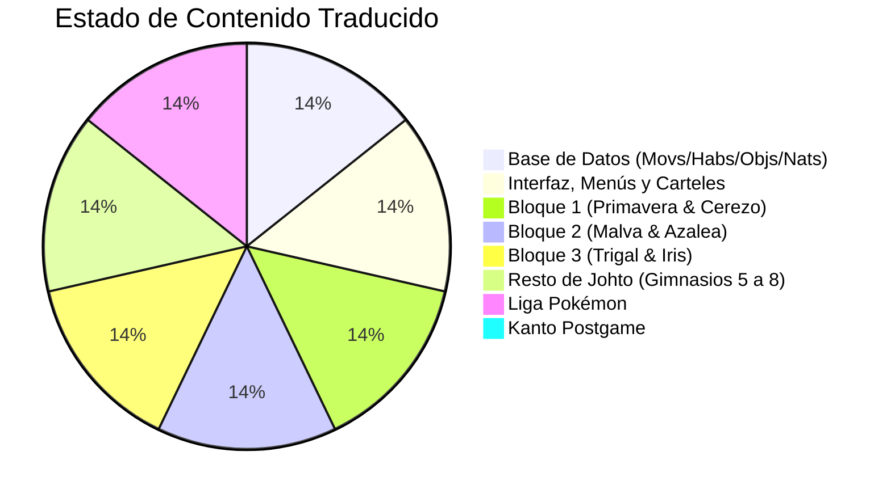

# 🗺️ Plan Maestro y Roadmap de Traducción: Pokémon Heart & Soul (HNS)

Documento central de seguimiento, directrices de localización, inventario de contenido y progreso de la traducción al castellano de **Pokémon Heart & Soul (pokehns-expansion)**.

---

## 📌 Reglas de Oro y Criterios Técnicos del Proyecto

1. **Regla de Nombres vs. Descripciones (Estricta - Anti-Solapamiento)**:
   - **NOMBRES en ESPAÑOL**: Movimientos (`Destructor`, `Golpe Kárate`), Habilidades (`Hedor`, `Llovizna`), Objetos (`Poké Ball`, `Superpoción`) y Naturalezas (`FIRME`, `MODESTA`, `ALEGRE`).
   - **DESCRIPCIONES en INGLÉS**: Movimientos, habilidades y objetos se conservan en inglés canónico upstream para evitar desbordamientos, solapamientos en pantalla de datos y fallos en el motor de batalla.
2. **Directrices de UI y Ajustes Visuales**:
   - `PODER` en lugar de _Potencia_ (evita pisar la categoría de daño).
   - `PRECIS.` en lugar de _Precisión_ (evita chocar con el número 100).
   - Estadísticas en Ficha Pokémon: `PS`, `ATAQUE`, `DEFENSA`, `AT. ESP`, `DF. ESP`, `VEL.` (evita desbordar la caja verde).
   - Altura de ventana de Habilidad fijada a `4 tiles` en `src/pokemon_summary_screen.c` (impide que invada la ventana de Notas/Naturaleza del Pokémon).
3. **Personalidad del Rival (Silver)**:
   - Adaptación con tono de **cani de barrio agresivo, vacilón y chulo** (_"¿Tú qué miras, pringao?"_, _"¡Te voy a abrir la cabeza pa' que espabiles!"_, _"¡Me la suda!"_, _"¡Es mi TARJETA, mangante!"_), respetando siempre el hilo y sentido argumental del juego.
4. **Entorno de Compilación y Flujo de Entrega**:
   - Todo cambio debe integrarse y compilarse en WSL nativo (`/home/falan/pokehns-expansion`) con `make -j8`.
   - Verificación directa de los strings en el binario `.gba` mediante charmap de GBA.
   - Entrega simultánea en `y:\heartandsoul_esp\pokehns_fase1.gba` y en `y:\heartandsoul_esp\releases\pokehns-0.3.X-es.gba`.

---

## 📊 Resumen Ejecutivo de Estado

---

## 🧭 FASE 1: Motor y Base de Datos Global

| Componente                        | Archivo(s)              | Estado  | Detalle                                                 |
| :-------------------------------- | :---------------------- | :-----: | :------------------------------------------------------ |
| **Nombres de Movimientos**        | `src/data/moves_info.h` | ✅ 100% | 899 movimientos oficiales traducidos al castellano      |
| **Descripciones de Movimientos**  | `src/data/moves_info.h` | ✅ 100% | En inglés canónico para evitar solapamientos            |
| **Nombres de Habilidades**        | `src/data/abilities.h`  | ✅ 100% | Habilidades oficiales traducidas al castellano          |
| **Descripciones de Habilidades**  | `src/data/abilities.h`  | ✅ 100% | En inglés canónico                                      |
| **Nombres de Objetos**            | `src/data/items.h`      | ✅ 100% | 860 objetos traducidos al castellano                    |
| **Descripciones de Objetos**      | `src/data/items.h`      | ✅ 100% | En inglés canónico                                      |
| **Naturalezas Pokémon**           | `src/pokemon.c`         | ✅ 100% | Las 25 naturalezas traducidas (`FIRME`, `ALEGRE`, etc.) |
| **Mensajes del Motor de Batalla** | `src/battle_message.c`  | ✅ 100% | Mensajes esenciales traducidos al castellano            |

---

## 🖥️ FASE 2: Interfaz de Usuario, Menús y Cartelería

| Componente                                  | Archivo(s)                                                  | Estado  | Detalle                                                                                         |
| :------------------------------------------ | :---------------------------------------------------------- | :-----: | :---------------------------------------------------------------------------------------------- |
| **Menú Principal / Pantalla de Título**     | `src/main_menu.c`                                           | ✅ 100% | `NUEVA PARTIDA`, `CONTINUAR`, `REGALO MISTERIOSO`, `OPCIONES`, `JUGADOR`, etc.                  |
| **Discurso Inicial Prof. Oak**              | `data/text/oak_speech_hns.inc`                              | ✅ 100% | Bienvenida, mundo Pokémon, selección chico/chica, dificultad y despedida                        |
| **Menú de Opciones**                        | `src/option_menu.c`                                         | ✅ 100% | Pestañas `OPCIONES`, `COMBATE`, `SONIDO`, textos y opciones adaptados                           |
| **Menú de Modos de Reto / Nuzlocke**        | `src/challenge_menu.c`                                      | ✅ 100% | Pestañas `MODO`, `RANDOMIZER`, `NUZLOCKE`, `DIFICULTAD`, `DESAFÍOS` con descripciones           |
| **Menú Contextual del Equipo (Party Menu)** | `src/data/party_menu.h`                                     | ✅ 100% | `DATOS`, `CAMBIAR`, `OBJETO`, `QUITAR`, `MOVER`, `CARTA`, `{PKMN} SEGUIDOR`, `CAMBIO`, `ENVIAR` |
| **Ficha Pokémon (Summary Screen)**          | `src/pokemon_summary_screen.c`, `src/strings.c`             | ✅ 100% | `AT. ESP`, `DF. ESP`, `VEL.`, `PODER`, `PRECIS.`, sin solapamiento con Naturaleza               |
| **Sistema de Cajas del PC (Storage)**       | `src/pokemon_storage_system.c`                              | ✅ 100% | Carteles, ventanas de diálogo, sacar, depositar, mover, soltar                                  |
| **Carteles Emergentes de Zonas (Banners)**  | `src/region_map.c`                                          | ✅ 100% | Ciudades y Rutas de Johto (Pueblo Primavera, Ciudad Cerezo, Rutas 26-48, etc.)                  |
| **Mochila (Bag)**                           | `src/item_menu.c`, `src/strings.c`                          | ✅ 100% | Bolsillos, opciones de objetos y descripciones de interfaz                                      |
| **Pokégear y Mapa de la Región**            | `src/data/region_map/region_map_entries.h`, `src/strings.c` | ✅ 100% | Nombres de lugares en el mapa y opciones de radio                                               |

---

## 📖 FASE 3: Historia y Rutas (Región de Johto)

### Bloque 1: Inicio y Prólogo (Pueblo Primavera a Ciudad Cerezo)

- [x] **Pueblo Primavera (Exterior)**: Vecinos, postes, laboratorio exterior y primer encuentro con el Rival (`NewBarkTown_hns`).
- [x] **Casa del Jugador (1F y 2F)**: Madre (ahorros, Pokégear), consola, PC de la habitación (`NewBarkTown_PlayersHouse_1F/2F_hns`).
- [x] **Casas de Vecinos**: Casa de la amiga de mamá y casa de la familia de Elm (`NewBarkTown_House1/2_hns`).
- [x] **Laboratorio de Elm**: Discursos del Prof. Elm, elección de inicial (Cyndaquil, Totodile, Chikorita), entrega del Huevo, llamada por robo (`NewBarkTown_Lab_hns`).
- [x] **Encuentro con el Rival Cani (Pueblo Primavera)**: Espiando en la ventana del laboratorio y empujón.
- [x] **Encuentro y Combate con el Rival Cani (Ciudad Cerezo)**: Diálogos callejeros, combate y robo de la tarjeta de entrenador.
- [x] **Ruta 29**: Entrenadores, objetos, abuelo que te enseña a saltar terraplenes y tutorial de captura con Dude (`Route29_hns`).
- [x] **Ciudad Cerezo**: Guía turístico (tour completo), entrega del Mapa, Centro Pokémon, Tienda, pescador con Agua Mística y casas de vecinos (`CherrygroveCity_hns` e interiores).
- [x] **Ruta 30**: Entrenadores (Joey y Mikey combatiendo), casa del señor de las bayas y carteles (`Route30_hns` y `Route30_House_hns`).
- [x] **Casa del Sr. Pokémon**: Entrega del Huevo Misterioso, encuentro con el Prof. Oak y entrega de la Pokédex oficial (`Route30_MrPokemonsHouse_hns`).

---

### Bloque 2: Primera y Segunda Medalla (Malva y Azalea)

- [x] **Ruta 31**: Conexión con Cueva Oscura (Dark Cave), entrega de la MT44 (Descanso), Wade y carteles.
- [x] **Ciudad Malva (Violet City)**:
  - Centro Pokémon (ayudante de Elm entregando el Huevo de Togepi, Bill y Team Rocket lore).
  - Escuela Pokémon del Profesor Earl (lecciones de combate, estado, Exp Share y tutorial de Earl).
  - Intercambio de Onix por Bellsprout en una de las casas ("Rocoso").
  - **Torre Bellsprout**: Diálogos de los monjes, ascenso, monólogo del Rival y Sabio Li (entrega de la MT70 Destello).
  - **Gimnasio Malva**: Entrenadores de vuelo y líder **Pegaso** (Medalla Céfiro + MT Respiro/Golpe Aéreo).
- [x] **Rutas 32 y Ruinas Alfa**:
  - Investigadores de Ruinas Alfa, panel de investigación y cámaras de misterio.
  - Vendedor ambulante de Colaslowpoke por 1.000.000₽.
  - Viki entregando Flecha Venenosa los viernes.
  - Pescador que da la Caña Vieja en el Centro Pokémon de la Ruta 32.
- [x] **Cueva Unión (Union Cave)**: Montañeros, pescadores, sótano del Lapras de los viernes.
- [x] **Ruta 33**: Clima de lluvia, montañeros y acceso a Azalea.
- [x] **Pueblo Azalea**:
  - Recluta Rocket custodiando el pozo y folklore de Slowpoke.
  - Casa de César (Kurt): Diálogos sobre los Bonguris, rabia contra el Team Rocket y agradecimiento.
  - **Pozo Slowpoke**: Infiltración contra el Team Rocket cortando colas, Kurt herido y combate contra Ejecutivo Protón.
  - **Gimnasio Azalea**: Telarañas, bichomaníacos y líder **Antón** (Medalla Colmena + MT Ida y Vuelta).
  - Combate con el Rival Cani al salir hacia el Encinar y monólogo post-combate.

> **Revisión 0.8.1 (20/09/2026):** auditados de nuevo los 35 archivos del Bloque 2; corregidos restos en inglés, concatenaciones defectuosas y líneas de más de 35 caracteres.

---

### Bloque 3: Tercera y Cuarta Medalla (Trigal e Iris)

- [ ] **Encinar (Ilex Forest)** — revisión pendiente de los tutores compartidos:
  - Minijuego de persecución de los Farfetch'd perdidos del carbonero.
  - Entrega de la MO01 Corte por parte del aprendiz de carbonero.
  - Tutor de Cabezazo y Altar del Guardián del Bosque (Celebi).
- [ ] **Ruta 34**: revisión pendiente de los responsables de la Guardería y las fichas de Pokémon bebé.
- [ ] **Ciudad Trigal (Goldenrod City)**: revisión integral pendiente de NPC, Centro Comercial, Casino, Torre Radio y zona de conexión.
  - **Centro Comercial de Trigal**: Recepcionista y directorio.
  - **Torre Radio de Trigal**: Tarjeta de Radio (test de preguntas de 5 rondas), programa de radio y entrega de la tarjeta.
  - Floristería: Obtención de la Regadera Squirtbottle tras vencer en el gimnasio y florista de mentas.
  - Casa de Bill: Entrega del Eevee y teléfono de Bill.
  - Casa del Inspector de Motes y Evaluador de Felicidad.
  - Subterráneo de Trigal: Encuentro y combate contra el Rival Cani Silver y Chica Kimono.
  - Tienda de Bicis: Préstamo de la bicicleta con selector de marchas.
  - **Gimnasio Trigal**: Entrenadoras, líder **Blanca** (Miltank Desenlace, Medalla Planicie + MT Atracción) y su berrinche al perder.
  - Terminal del Magnetotrén (bloqueado por falta de energía).

> **Revisión pendiente 22/09/2026:** el porcentaje histórico no reflejaba varios
> textos compartidos y secundarios que siguen en inglés. El inventario y las
> propuestas se recogen en `docs/traduccion/propuestas_bloque3_textos.md`.
- [x] **Ruta 35 y Parque Nacional**: Concurso de captura de bichos (martes, jueves y sábados con Parque Balls), Oficial con la carta de Spearow, dama con Garra Rápida y entrenadores.
- [x] **Ruta 36**: Encuentro con el árbol bailarín **Sudowoodo** (uso de la Regadera), Karateka de MO Golpe Roca y Arturo del Jueves.
- [x] **Ruta 37**: Bosque de Bonguris, Domingo con Imán y entrenadoras gemelas Ana y Anita.
- [x] **Ciudad Iris (Ecruteak City)**:
  - Centro Pokémon: Encuentro con Bill (habilitación del sistema de PC).
  - Teatro de Danza: Las 5 Chicas Kimono (Eeveeluciones), combate contra el Recluta Rocket y entrega de la MO03 Surf.
  - **Torre Quemada**: Encuentro con Euskadi (Eusine) y Morti, combate contra el Rival Cani con diálogos macarras, descenso al sótano y liberación de Raikou, Entei y Suicune.
  - **Torre Hojalata / Campana**: Acceso custodiado por los sabios del Trío Sabio y Campana Clara.
  - **Gimnasio Iris**: Suelo invisible de abismo, médiums, sabios y líder **Morti** (Medalla Niebla + MT Bola Sombra).

---

### Bloque 4: Quinta y Sexta Medalla (Olivo y Orquídea)

- [x] **Rutas 38 y 39**: Entrenadores, marineros, Granja Mu-Mu (curar al Miltank enfermo dándole Bayas Aranja para obtener Leche Mu-Mu y MT Robo).
- [x] **Ciudad Olivo (Olivine City)**:
  - Cafetería Marinera (recompensa MO Fuerza).
  - Casas de Olivo (intercambio Voltorb, pescador de Caña Buena, advertencias de islas).
  - **Faro de Olivo**: Ascenso por el faro, combate con marineros y caballeros, encuentro con Yasmina cuidando del enfermo Ampharos (Amphy).
  - Puerto de Olivo: Acceso al S.S. Aqua hacia Kanto, encuentro con el Prof. Oak y actualización a Pokédex Nacional.
- [x] **Rutas 40 y 41 (Canal Marino)**: Nadadores, Luna de los Hermanos de los Días (Pico Afilado), remolinos gigantes bloqueando las **Islas Remolino** (Whirl Islands).
- [x] **Ciudad Orquídea (Cianwood City)**:
  - Farmacia con 500 años de historia (obtención de la Medicina Secreta para Amphy).
  - Casa de la esposa de Aníbal (entrega MO Vuelo tras ganar la medalla).
  - Pescador que regala Tentacool y Pokemaníaco asustado que entrega a Shuckle ("Shuckie").
  - Encuentro con Suicune huyendo por las olas y combate contra Euskadi (Eusine).
  - **Gimnasio Orquídea**: Puzle de empujar rocas, káratekas y líder **Aníbal** (Medalla Tormenta + MT Puño Certero).
- [x] **Regreso a Olivo**:
  - Subida al Faro con la Poción Secreta, curación de Amphy y retorno de Yasmina al gimnasio.
  - **Gimnasio Olivo**: Líder **Yasmina** (Steelix, Medalla Mineral + MT Cola Férrea) e intercambio opcional de su Steelix "Oxidito".

---

### Bloque 5: Séptima Medalla e Invasión Rocket (Caoba y Trigal)

- [x] **Ruta 42 y Monte Mortero (Mt. Mortar)**: Cuevas multinivel, Rey Karateka Kiyo (entrega de Tyrogue).
- [x] **Pueblo Caoba (Mahogany Town)**:
  - Tienda de souvenirs sospechosa con antena oculta.
  - Salida este bloqueada por un tipo que te vende un Caramelo Furia por 300₽.
- [x] **Ruta 43**: Peaje extorsionado por reclutas Rocket (cobro de 1.000₽ por cruzar).
- [x] **Lago de la Furia (Lake of Rage)**:
  - Combate y captura del **Gyarados Rojo**.
  - Encuentro con el Campeón **Lance** y Dragonite en la orilla del lago para planear el ataque a Caoba.
- [x] **Guarida Secreta del Team Rocket (Caoba)**:
  - Trampas con estatuas de Persian, baldosa alarma y científicos Rocket.
  - Obtención de contraseñas con ayuda de Lance.
  - Combate con el Ejecutivo Petrel y Ejecutivo Murkrow que imita voces.
  - Desconexión del generador venciendo a los Electrodes con Lance.
  - Recompensa de la MO06 Torbellino.
- [x] **Gimnasio Caoba**: Puzles de suelo deslizante de hielo y líder **Fredo** (Medalla Glaciar + MT Ventisca/Rayo Hielo).
- [x] **Crisis de la Torre Radio de Trigal (Gran Golpe Rocket)**:
  - Llamada de socorro del Prof. Elm por la radio.
  - Invasión total de Ciudad Trigal por el Team Rocket.
  - Disfraz de Recluta Rocket en el subterráneo desbaratado por el Rival Cani.
  - Rescate del verdadero Director de la Radio en los almacenes subterráneos.
  - Ascenso a la Torre Radio: Derrota de los Ejecutivos Proton, Petrel, Atenea y combate final contra Atlas en el mirador.
  - Disolución final del Team Rocket en Johto y entrega del Ala Arcoíris / Plateada por el Director.

---

### Bloque 6: Octava Medalla, Leyenda y Liga Pokémon (Endrino y Meseta Añil)

- [x] **Ruta 44 y Ruta Helada (Ice Path)**:
  - Puzles complejos sobre pistas de hielo resbaladizo, empuje de rocas con Fuerza.
  - Obtención de la MO07 Cascada.
- [x] **Ciudad Endrino (Blackthorn City)**:
  - Casa del Quita-Movimientos y Recuerda-Movimientos.
  - **Gimnasio Endrino**: Plataformas sobre lava ardiente, entrenadores dragón y líder **Débora** (Kingdra).
  - Negativa de Débora a darte la medalla hasta superar la prueba.
- [x] **Guarida Dragón (Dragon's Den)**:
  - Uso de Torbellino, llegada al Templo del Clan Dragón.
  - Prueba ética del Maestro de los Dragones (preguntas sobre cómo tratas a tus Pokémon).
  - Entrega forzada de la Medalla Dragón y regalo del Dratini con Velocidad Extrema.

> **Entrega 0.9.0 (20/09/2026):** completados y auditados Ruta 44, Ruta Helada, Ciudad Endrino, Gimnasio Endrino y Guarida Dragón. El Bloque 6 continúa con la invocación legendaria y el camino hacia la Liga.

- [x] **Invocación del Guardián Legendario**:
  - Regreso al Teatro de Danza de Iris: Combate consecutivo contra las 5 Chicas Kimono.
  - Evento en la Torre Hojalata (Ho-Oh) o Islas Remolino (Lugia) con cinemáticas y combate legendario.
- [x] **Rutas 45, 46 y 27 (Hacia la Liga)**:
  - Cruce de las Cataratas Tohjo (Tojho Falls).
  - Rutas 26 y 27 con entrenadores de alto nivel y casa de descanso de la anciana que cura tu equipo.
  - Control de paso de las 8 medallas oficiales de Johto.
- [x] **Calle Victoria (Victory Road)**:
  - Laberinto de rocas y túneles oscuros.
  - **Combate final contra el Rival Cani** justo antes de la salida al exterior.
- [x] **Meseta Añil (Indigo Plateau)**:
  - Tienda y Centro Pokémon de la Liga.
  - **Alto Mando Mento** (Psíquico: Xatu, Jynx, Slowbro).
  - **Alto Mando Koga** (Veneno: Ariados, Forretress, Muk, Crobat).
  - **Alto Mando Bruno** (Lucha: Hitmontop, Hitmonlee, Hitmonchan, Machamp).
  - **Alto Mando Karen** (Siniestro: Umbreon, Gengar, Murkrow, Houndoom).
  - **Campeón Lance**, ceremonia posterior y registro en el Hall de la Fama.

> **Entrega 0.14.0 (22/09/2026):** traducidos y auditados la invocación de
> Ho-Oh/Lugia, Ruta 45, Ruta 46, Cataratas Tohjo, Rutas 27 y 26, control de
> medallas, Calle Victoria, Meseta Añil, Alto Mando, Lance y Hall de la Fama.
> Auditoría superada sin inglés residual detectado, segmentos de más de 35
> caracteres ni uso duplicado de `\n` en el lote.
  - **Campeón Lance** (Dragones: Gyarados, Charizard, Aerodactyl y 3 Dragonite).
  - Sala de la Fama y créditos del juego.

---

## 🗺️ FASE 4: Postgame (Región de Kanto y Desafíos Finales)

- [ ] **Viaje en el S.S. Aqua**: Pase en barco de Olivo a Carmín, búsqueda de la nieta perdida del capitán.
- [ ] **Las 8 Medallas de Kanto**:
  - Ciudad Carmín (Teniente Surge / Medalla Trueno).
  - Ciudad Azafrán (Sabrina / Medalla Pantano) y Dojo Kárate.
  - Ciudad Azulona (Erika / Medalla Arcoíris) y Mansión Azulona con Game Freak.
  - Ciudad Fucsia (Sachiko / Medalla Alma) y Zona Safari.
  - Ciudad Celeste (Misty / Medalla Cascada) y Cabo Celeste con Bill.
  - Ciudad Verde (Azul / Green / Medalla Tierra).
  - Ciudad Plateada (Brock / Medalla Roca).
  - Isla Canela e Islas Espuma (Blaine / Medalla Volcán).
- [ ] **Crisis de la Central de Energía de Kanto**:
  - Recluta Rocket fugitivo en el Gimnasio Celeste.
  - Recuperación de la Maquinaria en el agua del gimnasio y reactivación del Magnetotren.
- [ ] **Despertar del Snorlax**: Obtención de la Pokeflauta por radio en la Torre Radio de Lavanda.
- [ ] **Monte Plateado (Mt. Silver)**:
  - Permiso del Prof. Oak tras reunir las 16 medallas.
  - Cueva profunda con Pokémon salvajes de nivel extremo.
  - **Combate Legendario contra Rojo (Red)** en la cima nevada.

---

## 🛠️ Registro de Cambios Técnicos Específicos Realizados

1. **`src/pokemon_summary_screen.c`**:
   - Reducción de la ventana `PSS_DATA_WINDOW_INFO_ABILITY` a `.height = 4` (solución definitiva al texto montado sobre la Naturaleza).
2. **`src/strings.c`**:
   - `gText_Accuracy2` = `PRECIS.` (evita choque visual con el valor 100).
   - `gText_SpAtk4` = `AT. ESP`, `gText_SpDef4` = `DF. ESP`, `gText_Speed2` = `VEL.` (encuadre perfecto en la ficha).
   - `gText_Power` = `PODER` (resuelto solapamiento de potencia con categoría físico/especial).
3. **`src/data/party_menu.h`**:
   - Traducción de todos los comandos del menú de equipo: `DATOS`, `CAMBIAR`, `OBJETO`, `QUITAR`, `MOVER`, `CARTA`, `{PKMN} SEGUIDOR`, `CAMBIO`, `ENVIAR`, opciones de tutores y máquinas.
4. **`src/region_map.c`**:
   - Carteles y popups de entrada de zona traducidos (`PUEBLO PRIMAVERA`, `CIUDAD CEREZO`, Rutas 26-48 y mazmorras).
5. **`data/maps/NewBarkTown_hns/scripts.inc` & `CherrygroveCity_hns/scripts.inc`**:
   - Diálogos del Rival con tono callejero/cani implementados y validados.
